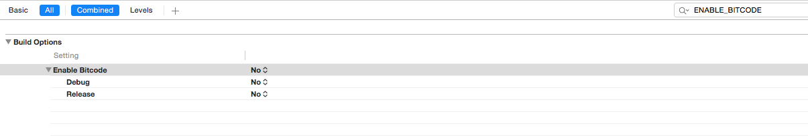

Gyant iOS SDK
==================


# About

GYANT combines messaging, AI, and medical experts to radically improve the diagnosis and treatment of non-urgent conditions. GYANT makes treatment faster, more effective & more delightful. Our purpose is to transform healthcare from the outside in — to create a new care standard for everyone.

# Requirements
 - iOS 10+
 - Xcode 10.2.1+

# Setup using CocoaPods 

Add Gyant repo:

```
pod repo add gyant-podspecs git@github.com:GYANTINC/gyant-podspecs.git
```

Add Gyant Specs source to your Podfile in the following order:

```
source 'git@github.com:GYANTINC/gyant-podspecs.git'
source 'https://github.com/CocoaPods/Specs.git'
```

**Make sure gyant-podspecs source is the first one**

Add GyantChatSDK pod to your app target.

```
pod 'GyantChatSDK', '~> 1.0.6'
```

Install the pod.

```
pod install
```

## Disable Bitcode

GyantChatSDK does not offer bitcode compatibility for now.

Make sure to disable bitcode in your build settings:



## Add NSLocationWhenInUseUsageDescription

Adding the NSLocationWhenInUseUsageDescription key in Info.plist is required to enable the app to access the user location. The user location is required in some user flows like Find a Clinic, etc.


## Getting Started with Swift

1. Import the GyantChatSDK framework in the application delegate.

    ```swift
    import GyantChatSDK
    ```

2. Start the SDK by adding the following code snippet in the `application:didFinishLaunchingWithOptions:` application delegate method.

    ```swift
    GyantChat.start(withClientID: "<YOUR-CLIENT-ID>",
                    patientID: "<YOUR-PATIENT-ID-OPTIONAL>",
                    theme: nil,
                    isDev: true)
    ```
    
    or, if you want to change the chat view appearance:
    
     ```swift
     let botPalette = ["primaryColor1":"ff0000"]
     let providerPalette = ["primaryColor1":"00ff00"]
     let theme = ["bot": botPalette, "provider": providerPalette]
     GyantChat.start(withClientID: "hf-fd",
                     patientID: nil,
                     theme: theme,
                     isDev: true)
    ```
    
    For more details about theme configuration read [here](#theme-configuration).

    
    **Note**: The andIsDev parameter must be changed to false before submitting the app to production. 
        
3. Present the chat view by adding the following code snipped in any view controller.

    ```swift
    let chatVC = GyantChat.createChatViewController()!
    self.present(chatVC, animated: true, completion: nil)
    ```

## Getting Started with Objective-C

1. Import the GyantChatSDK framework in the application delegate.

    ```objective-c
    #import <GyantChatSDK/GyantChatSDK.h>
    ```

2. Start the SDK by adding the following code snippet in the `application:didFinishLaunchingWithOptions:` application delegate method.

    ```objective-c
    [GyantChat startWithClientID:@"<YOUR-CLIENT-ID>"
               patientID:@"<YOUR-PATIENT-ID-OPTIONAL>"
               theme:nil
               isDev:YES];
    ```
    
    or, if you want to change the chat view appearance:
    
     ```objective
     NSDictionary *botPalette = @{"primaryColor1":"ff0000"};
     NSDictionary *providerPalette = @{"primaryColor1":"00ff00"};
     NSDictionary *theme = @{"bot": botPalette, "provider": providerPalette};
     [GyantChat startWithClientID:@"<YOUR-CLIENT-ID>"
                    patientID:@"<YOUR-PATIENT-ID-OPTIONAL>"
                    theme:theme
                    isDev:YES];
    ```
    
    For more details about theme configuration read [here](#theme-configuration).
    
    **Note**: The andIsDev parameter must be changed to false before submitting the app to production.
    
3. Present the chat view by adding the following code snipped.

    ```objetive-c
    UIViewController *chatVC = [GyantChat createChatViewController];
    [self presentViewController:chatVC animated:true completion:nil];
    ```

## Include the SDK for iOS in an Existing Application

The [samples](https://github.com/GYANTINC/gyant-ios-sdk-samples) included with the SDK for iOS are standalone projects that are already set up for you. You can also integrate the SDK for iOS with your own existing project.

## Theme Configuration

To allow a more seamless integration into existing apps, the SDK supports color customization. Currently, two different palletes are available: bot and provider. The bot palette is used during chat bot conversations while the provider will be loaded when the user is talking to a human (doctor, nurse, etc).

For each palette the following RGB colors could be customized:

<table>
  <tr>
    <th>Name</th>
    <th>Description</th>
    <th>bot</th>
    <th>provider</th>
  </tr>
  <tr>
    <td>primaryColor1</td>
    <td><ul><li>Background color</li><li>Auto-complete matches highlight text color</li><li>Hyperlink text color</li></ul></td>
    <td>ff4cb9f7</td>
    <td>ff1f5075</td>
  </tr>
  <tr>
    <td>primaryColor2</td>
    <td>Clinic and Provider cards text color</td>
    <td>ff3ea9f5</td>
    <td>ff3ea9f5</td>
  </tr>
  <tr>
    <td>primaryColor3</td>
    <td>n/a</td>
    <td></td>
    <td></td>
  </tr>
  <tr>
    <td>primaryColor4</td>
   <td><ul><li>QuickResponses bubble background color</li><li>Input box background color</li><li>User bubble background color</li></td>
    <td>ff79c7ff</td>
    <td>ff296a9c</td>
  </tr>
  <tr>
    <td>secondaryColor1</td>
    <td><ul><li>Auto-complete list background color</li><li>Connecting indicator background color</li><li>Scroll to bottom button icon color</li><li>Send button enabled icon color</li><li>Input box cursor color</li><li>Undo button icon color</li></ul></td>
    <td>ffffffff</td>
    <td>ffffffff</td>
  </tr>
  <tr>
    <td>secondaryColor2</td>
    <td>Success notification background color</td>
    <td>ff4cd964</td>
    <td>ff4cd964</td>
  </tr>
  <tr>
    <td>secondaryColor3</td>
    <td>Error notification background color</td>
    <td>fff55040</td>
    <td>fff55040</td>
  </tr>
  <tr>
    <td>secondaryColor4</td>
    <td>Provider bubble background color</td>
    <td>ff62849e</td>
    <td>ff62849e</td>
  </tr>
  <tr>
    <td>extraColor1</td>
    <td><ul><li>Card title text color</li><li>Connecting indicator text color</li><li>Auto-complete non-matches text color</li></ul></td>
    <td>ff13324a</td>
    <td>ff0f77c6</td>
  </tr>
  <tr>
    <td>extraColor2</td>
    <td>Card subtitle text color</td>
    <td>ff767676</td>
    <td>ff767676</td>
  </tr>
  <tr>
    <td>extraColor3</td>
    <td>Send button disabled icon color</td>
    <td>ffaaaaaa</td>
    <td>ffaaaaaa</td>
  </tr>
  <tr>
    <td>extraColor4</td>
    <td>n/a</td>
    <td></td>
    <td></td>
  </tr>
  <tr>
    <td>extraColor5</td>
   <td><ul><li>Scroll to bottom button background color</li><li>Send button background color</li></td>
    <td>ff13324a</td>
    <td>ff13324a</td>
  </tr>
</table>

**Copyright © 2019 GYANT.com, Inc. All rights reserved.**
